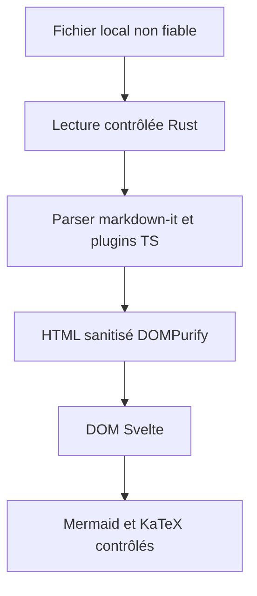

# Architecture visée

Ce document définit des frontières logiques à appliquer lors de la création du code. Les chemins de code ci-dessous sont **proposés**, non des dossiers déjà présents.

## Flux de lecture

Le moteur TypeScript est indépendant des composants Svelte ; seuls des types et interfaces explicites le relient à l'UI. Plugins GFM, footnotes, alerts, ancres et mathématiques sont isolés, testés par fixtures. La fidélité GitHub se mesure sur exemples ciblés ; les extensions non standard sont activées explicitement.

## Frontières proposées

| Responsabilité | Placement suggéré | Contrat |
| --- | --- | --- |
| Parser, règles d'extension, résolution des références | `src/lib/markdown/` | Entrée texte + contexte du fichier ; sortie sanitisable, liens typés et diagnostics |
| Composants et navigation | `src/lib/components/` | Reçoit le modèle de rendu ; n'accède pas aux chemins système arbitraires |
| Orchestration et préférences | `src/lib/app/` | État UI, thèmes, zoom, récents, erreurs |
| Commandes, filesystem, CLI, watcher | `src-tauri/src/` | Ouvre seulement les fichiers demandés ; valide et borne les opérations |
| Capacités et configuration Tauri | `src-tauri/` | Permissions et CSP au strict nécessaire |

La structure effective est fixée lors du bootstrap et documentée ici après validation. Les répertoires suggérés ne sont pas des obligations.

## Chemins, URLs et confiance

À l'ouverture, l'OS fournit un chemin ; Rust résout et valide les fichiers autorisés. Pour une référence relative, la base est le répertoire du **document qui contient la référence**. Un lien vers un autre `.md` change la base après ouverture. Traiter Unicode, espaces, chemins Windows, liens symboliques, traversées `..`, schémas interdits et ressources inexistantes. Définir séparément les règles pour chemins locaux, ancres et HTTP/HTTPS externes. L'application n'accorde pas la lecture illimitée du disque aux balises de contenu. La politique d'accès aux images hors du document doit être conçue et testée avant implémentation.

Le cadrage V0 définit maintenant la politique dans [ADR 0003](adr/0003-lecture-et-ressources.md)
et [SECURITY](SECURITY.md) : racine de session, extension native explicite,
handles opaques, raster local contrôlé et révocation. Le mécanisme d'accès
effectif reste à prototyper et tester en L04 ; la politique écrite ne prouve
ni le confinement ni la compatibilité des WebViews.

Le HTML brut issu de la source reste désactivé ; tout HTML produit passe par la sanitisation avant insertion dans le DOM. Les plugins qui génèrent des URLs ou du HTML passent par le même contrôle. Mermaid et KaTeX sont chargés à la demande ; traiter leurs entrées et sorties comme non fiables, interdire toute exécution script et vérifier les contraintes CSP. Détails : `docs/SECURITY.md`.

## Événements et performance

Une ouverture par dialogue, CLI, association ou glisser-déposer converge vers un même flux d'ouverture validé. Le watcher surveille uniquement le fichier courant, ferme l'ancien watcher, absorbe les événements rapprochés et préserve lecture, position et erreurs si le fichier disparaît. Les fichiers récents enregistrent des chemins locaux explicitement ouverts ; les préférences sont locales.

Mesurer latence premier affichage, consommation mémoire et navigation sur documents volumineux. Charger Mermaid, KaTeX et langages de highlight.js selon présence ; ne pas recalculer l'intégralité du DOM au moindre changement d'UI. Documenter le banc d'essai avant toute optimisation.

## Portabilité

Isoler les différences Linux/Windows/macOS dans l'intégration système : chemins, associations, WebView, installateurs, dialogues et comportement des liens. Construire les installateurs sur les plateformes natives appropriées ; valider l'ouverture CLI et par association sur chaque OS avant la release.
