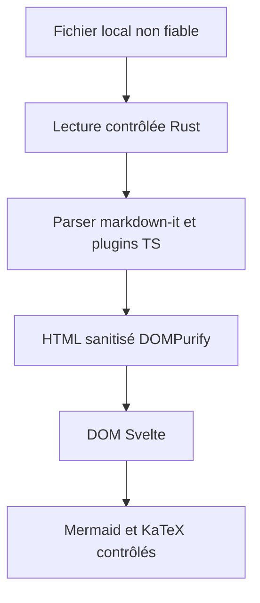
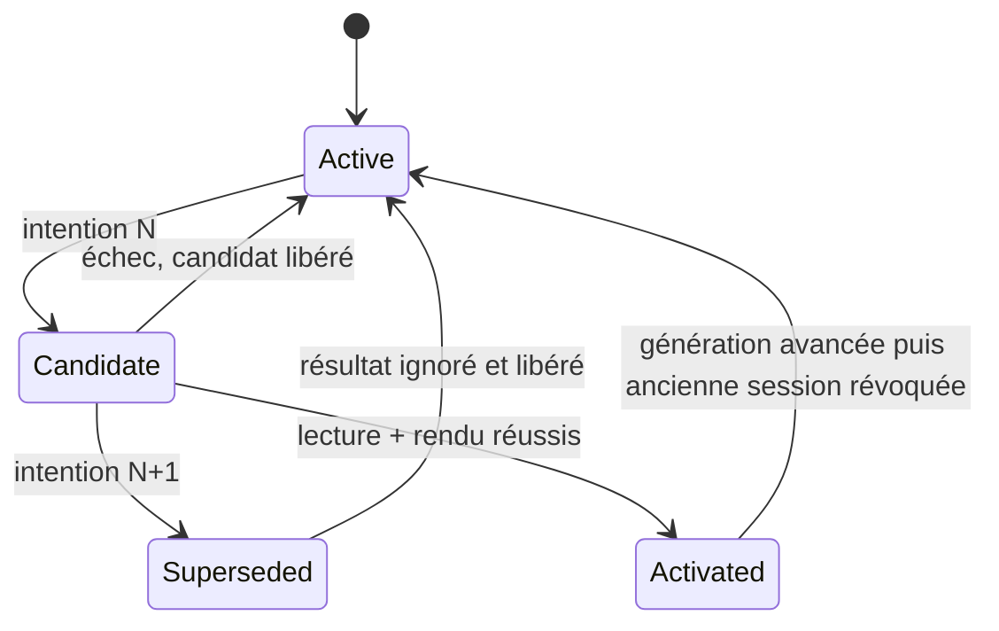

# Architecture visée

Ce document définit les frontières logiques du code. L04 matérialise les
contrats dans `src/lib/contracts/`, l'automate dans `src/lib/state/`, les profils
de rendu dans `src/lib/rendering/` et l'adaptateur de ressource dans
`src/lib/platform/`. V2 ajoute le service document Rust, le dialogue natif à
jeton opaque, le moteur Markdown indépendant et la coque Svelte. Le service de
ressources complet relève de L10 et le watcher de L17.

## Flux de lecture

Le moteur TypeScript est indépendant des composants Svelte ; seuls des types et interfaces explicites le relient à l'UI. Plugins GFM, footnotes, alerts, ancres et mathématiques sont isolés, testés par fixtures. La fidélité GitHub se mesure sur exemples ciblés ; les extensions non standard sont activées explicitement.

## Contrats figés en L04

`DocumentSnapshot`, `RenderResult`, `HeadingEntry`, `ResourceRequest`,
`ResolvedResource`, `DocumentService`, `WatchService`, `PreferenceService`,
`RenderGeneration` et `AppError` sont définis sans import Svelte/Tauri. ESLint
rend cette frontière vérifiable. Les chemins natifs ne figurent pas dans les
snapshots ou requêtes frontend ; seuls des identifiants opaques traversent IPC.

`OpenCoordinator` applique cette transition. Une annulation logique empêche un
résultat tardif d'être activé ; elle ne prétend pas interrompre un calcul
synchrone. Le scheduler démarre au plus deux enrichissements et conserve au plus
32 demandes en file, tandis que les précontrôles refusent les blocs hors budget.

## Frontières proposées

| Responsabilité | Placement suggéré | Contrat |
| --- | --- | --- |
| Parser, règles d'extension, résolution des références | `src/lib/markdown/` | Entrée texte + contexte du fichier ; sortie sanitisable, liens typés et diagnostics |
| Composants et navigation | `src/lib/components/` | Reçoit le modèle de rendu ; n'accède pas aux chemins système arbitraires |
| Orchestration et préférences | `src/lib/app/` | État UI, thèmes, zoom, récents, erreurs |
| Commandes, filesystem, CLI, watcher | `src-tauri/src/` | Ouvre seulement les fichiers demandés ; valide et borne les opérations |
| Capacités et configuration Tauri | `src-tauri/` | Permissions et CSP au strict nécessaire |

Le socle garde `src/` pour le frontend et `src-tauri/` pour le processus natif.
Le moteur `src/lib/markdown/engine.ts` reste indépendant de Svelte, du DOM et de
Tauri ; ESLint vérifie cette frontière.

## Autorisation d'ouverture V2

Le dialogue s'exécute dans Rust. Il ne retourne au frontend qu'un jeton aléatoire
à usage unique, conservé dans un registre borné ; aucun chemin natif n'entre dans
le snapshot ou le DOM. `open_document` consomme le jeton, revalide extension,
identité, type de fichier, taille et stabilité des métadonnées, puis décode
l'UTF-8 strict. Une sélection forgée, réutilisée ou remplacée est refusée.

Le moteur produit des titres déterministes, des déclarations de ressources et
des liens inertes `data-mdv-*`. DOMPurify retire les attributs URL avant le seul
point d'insertion Svelte. Un clic HTTP(S) exige confirmation puis une seconde
validation Rust avant ouverture dans le navigateur système ; une cible locale
reste inactive jusqu'à L10.

## Chemins, URLs et confiance

À l'ouverture, l'OS fournit un chemin ; Rust résout et valide les fichiers autorisés. Pour une référence relative, la base est le répertoire du **document qui contient la référence**. Un lien vers un autre `.md` change la base après ouverture. Traiter Unicode, espaces, chemins Windows, liens symboliques, traversées `..`, schémas interdits et ressources inexistantes. Définir séparément les règles pour chemins locaux, ancres et HTTP/HTTPS externes. L'application n'accorde pas la lecture illimitée du disque aux balises de contenu. La politique d'accès aux images hors du document doit être conçue et testée avant implémentation.

Le cadrage V0 définit la politique dans [ADR 0003](adr/0003-lecture-et-ressources.md)
et [SECURITY](SECURITY.md) : racine de session, extension native explicite,
handles opaques, raster local contrôlé et révocation. [ADR 0004](adr/0004-contrats-sessions-et-prototypes-l04.md)
retient un protocole à jetons : contrôle du handle effectivement ouvert sous
Linux, cache borné et suppression de tous les jetons à la révocation. Les
équivalents Windows/macOS restent à implémenter et qualifier, sans fallback
permissif.

Le HTML brut issu de la source reste désactivé ; tout HTML produit passe par la sanitisation avant insertion dans le DOM. Les plugins qui génèrent des URLs ou du HTML passent par le même contrôle. Mermaid et KaTeX sont chargés à la demande ; traiter leurs entrées et sorties comme non fiables, interdire toute exécution script et vérifier les contraintes CSP. Détails : `docs/SECURITY.md`.

## Événements et performance

Une ouverture par dialogue, CLI, association ou glisser-déposer converge vers un même flux d'ouverture validé. Le watcher surveille uniquement le fichier courant, ferme l'ancien watcher, absorbe les événements rapprochés et préserve lecture, position et erreurs si le fichier disparaît. Les fichiers récents enregistrent des chemins locaux explicitement ouverts ; les préférences sont locales.

Mesurer latence premier affichage, consommation mémoire et navigation sur documents volumineux. Charger Mermaid, KaTeX et langages de highlight.js selon présence ; ne pas recalculer l'intégralité du DOM au moindre changement d'UI. Documenter le banc d'essai avant toute optimisation.

## Portabilité

Isoler les différences Linux/Windows/macOS dans l'intégration système : chemins, associations, WebView, installateurs, dialogues et comportement des liens. Construire les installateurs sur les plateformes natives appropriées ; valider l'ouverture CLI et par association sur chaque OS avant la release.
