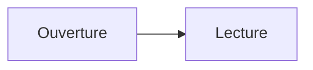
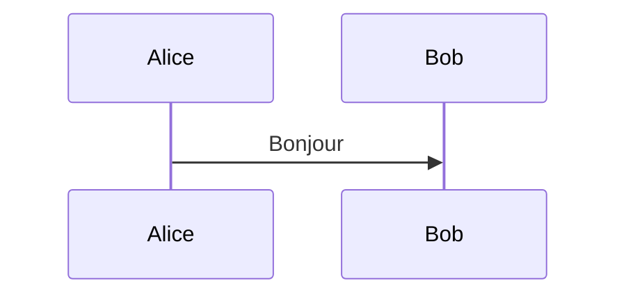
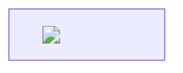

# Enrichisseurs valides et invalides








```mermaid
ceci n'est pas un diagramme
```

$E = mc^2$

$$
\frac{a}{b} + \sqrt{2}
$$

$\href{https://example.invalid}{lien}$
$\htmlClass{hostile}{x}$
$\def\boucle{\boucle}\boucle$
$\commandeInconnue{x}$

```langage-inconnu
<script>contenu de code</script>
```

Clôture malformée (le reste est du code) :

```text
bloc non fermé
