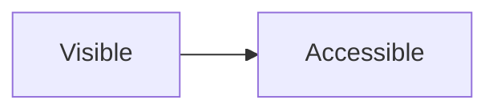

# Été à Alger

## Même titre
## Même titre
## même titre
### العربية 日本語 👋
#### Ponctuation : % # & ?
##### Niveau cinq
###### Niveau six

ÉTÉ été ete. À la recherche de [texte visible](https://example.invalid/cache).
Littéraux : .* [abc] café CAFE.

```text
Été dans le code ; mot_recherchable
```



$x + y$ et $\text{Formule}$.
