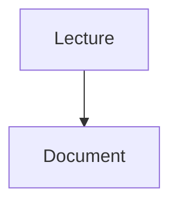
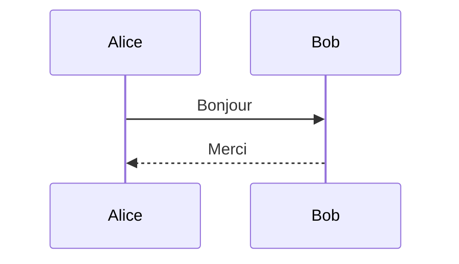
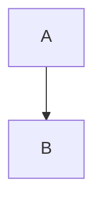

# Enrichissement V4

```mermaid
flowchart TD
 A[Lecture] --> B[Document]
```

```mermaid
flowchart TD
 A[Lecture] --> B[Document]
```

```mermaid
sequenceDiagram
 Alice->>Bob: Bonjour
 Bob-->>Alice: Merci
```

```mermaid
%%{init: {securityLevel: 'loose'}}%%
flowchart TD
 A-->B
```

```mermaid
invalide
```
