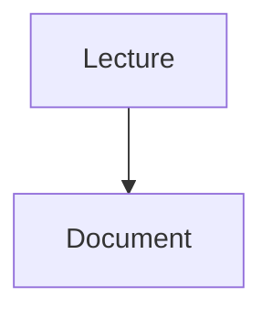
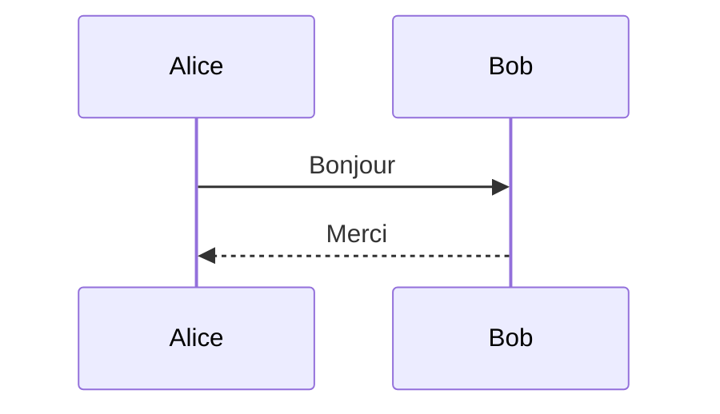
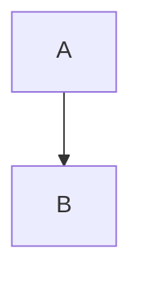

# Enrichissement V4








```mermaid
invalide
```


Maths : \(c = \sqrt{a^2+b^2}\). Monnaie : $20 et $30.

$$
\frac{1}{2} + x^2
$$

\(\undefinedcommand{x}\)

\(\gdef\leak{SECRET} \leak\)

\(\leak\)

\(\href{https://example.invalid}{danger}\)

```js
const greeting = "<script>danger</script>";
```

```inconnu

```

```rust
fn main() { println!("lecture"); }
```
